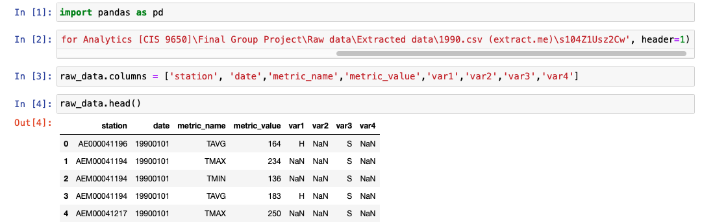
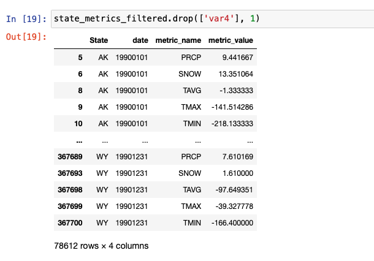
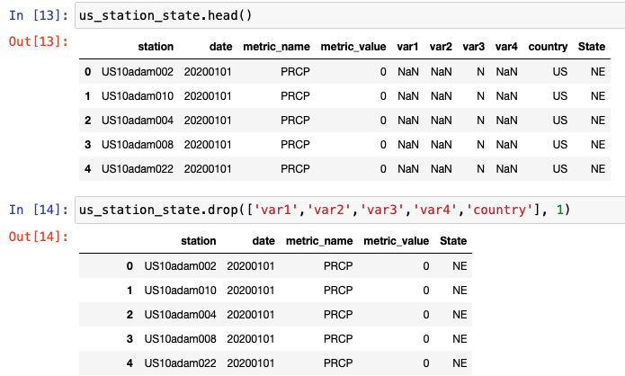

# 9650 Final Group Project

## Team Memembers: 
Shilpa Paidighantom, Carmen Ruan, Mingma Sherpa, 
Alexsandra Korzep, Katarzyna Borkowska, Lei Zhang
## Topic: Climate Change
---
**Problem Statement:**\
In this project, we are trying to answer the following questions:
* What are the key influencing factors of climate change in United States.
* How Meat Consumption, Food wastage are contributing to it?
* What will be the trend in next years?

**Objectives:**
* Perform factor analysis (PCA) to create climate change metric. Alternatively, climate change metric can be defined on one variable alone (such as daily average temperature)
* Build multivariate regression model to understand the drivers of climate change 
* Predict the impact of food industry on climate change and provide recommendations by states/clusters of states to reduce or control climate change 

**Table of Content**

1. [Data Collection](#Data-Collection)
2. [Data Processing](#Data-Processing)
3. [Data Cleaning](#Data-Cleaning)
4. [Data Analysis](#Data-Analysis)
5. [Related Reference](#Related-Reference)

#### Data Collection
We gathered information on targeted variables identified as data requirements. All data is collected from various sources ranging from organizational databases to the information in web pages. View all the data [here](https://github.com/snowmeatball/9650_GroupProject/blob/main/Data/readme.md)

Targeted variables:
* CO2 emission
* Petroleum carbon emission
* Natural gas carbon emission
* Electricity carbon emission
* Coal emission
* Population
* Natural gas consumption
* Petroleum consumption
* Coal consumption
* Meat consumption

#### Data Processing
The data obtained, may not be structured and may contain irrelevant information. Hence, the collected data is required to be subjected to Data Processing and Data Cleaning.

* Extracted data from 1990 to 2000 to the dataset we need. Here is an example how the data is processed:
```
raw data
```

```
new data
```



* Methodology to calculate the contribution of the factors affecting the climate change:
1. Segmentation: All the states in the US will be segmented for each year from 2010 to 2020 based on the evidence metrics such as 
    * PRCP_max_yoy: Maximum precipitation on a particular day between 2010 to 2019 - Maximum precipitation on a particular day between 2000 to 2009
    * SNOW_max_yoy: Maximum snowfall on a particular day between 2010 to 2019 - Maximum snowfall on a particular day between 2000 to 2009
    * TMAX_max_yoy: Maximum temperature on a particular day between 2010 to 2019 - Maximum temperature on a particular day between 2000 to 2009
    * Maximum temperature on a particular day between 2020 to 2010 - Maximum temperature on a particular day between 2000 to 2009

   
   Results from each year will be analyzed to create clusters to define ‘Good’/‘Average’/‘Bad’ states based on climate change. Total of 10+ such  segmentations will be performed to further segment the states as 
    * States showing high climate change
    * States showing no climate change
    * States improving from ‘Bad’ to ‘Good’
    * States worsening from ‘Good’ to ‘Bad’

 ```
 Example data of year 2020
 ```
<p align="center" width="100%">
     
</p>

2. Regression model:  individual regression models are built on each of the clusters to understand the factors(targeted varibales) driving climate change. 
   The model is built from 1990 – 2019. Variables which did not have the time period. The metrics are calculated at state yearly level.
   The log transformation is taken on the variables to build the model. The models are often referred as log-log models as the transformation is taken on both independent and dependent variable. OLS estimation methodology is used, can improve the model efficiency with few more iterations. 


#### Data Cleaning
The processed and organized data may be incomplete, contain duplicates, or contain errors.
To prevent errors, incorrect, corrupted, incorrectly formatted, duplicate, or incomplete data had been removed within a dataset. 

For example, the data below contains many columns with null values, which is incomplete and irrelevant to our topic, so those columns were removed.



#### Data Analysis
Within the data, here is what we found:
```
Climate change is real. Both global average temperature(top graph)and North American average temperature 
has increased by 1 degree in recent 20 years. It is beyong natural change. 
```
<p align="center" width="100%">
     
     
</p>

```
Analyzing hottest years by month, we see years >= 2000 among top 10. 7 out of 10 hottest years for January
is after the year 2020. This further shows how fast climate change is happening in the recent 20 years. 
```
<p align="center" width="100%">
     
</p>

```
CO2 emission, petroleum emission,gas emission, coal emission and electricity emission has more influence on climate changes than other factors.
```
<p align="center" width="100%">
     
</p>


#### Related Reference
