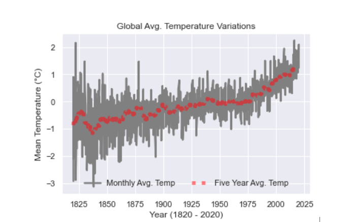

# 9650 Final Group Project

## Team Memembers: 
Shilpa Paidighantom, Carmen Ruan, Mingma Sherpa, 
Alexsandra Korzep, Katarzyna Borkowska, Lei Zhang
## Topic: Climate Change
---
**Problem Statement:**\
In this project, we are trying to answer the following questions:
* What are the key influencing factors of climate change in United States.
* How Meat Consumption, Food wastage are contributing to it?
* What will be the trend in next years?

**Objectives:**
* Perform factor analysis (PCA) to create climate change metric. Alternatively, climate change metric can be defined on one variable alone (such as daily average temperature)
* Build multivariate regression model to understand the drivers of climate change 
* Predict the impact of food industry on climate change and provide recommendations by states/clusters of states to reduce or control climate change 

**Table of Content**

1. [Data Collection](#Data-Collection)
2. [Data Processing](#Data-Processing)
3. [Data Cleaning](#Data-Cleaning)
4. [Data Analysis](#Data-Analysis)
5. [Related Reference](#Related-Reference)

#### Data Collection
We gathered information on targeted variables identified as data requirements. All data is collected from various sources ranging from organizational databases to the information in web pages.View all the data [here](#)\

Targeted variables:
* Deforestation
* Fertilizer Use
* Methane Emission
* Population Growth
* Fossile Fuels
* Daily Temperatures
* Meat Consumption
* Food Wastage

The data thus obtained, may not be structured and may contain irrelevant information. Hence, the collected data is required to be subjected to Data Processing and Data Cleaning.
#### Data Processing

#### Data Cleaning

#### Data Analysis

#### Related Reference

